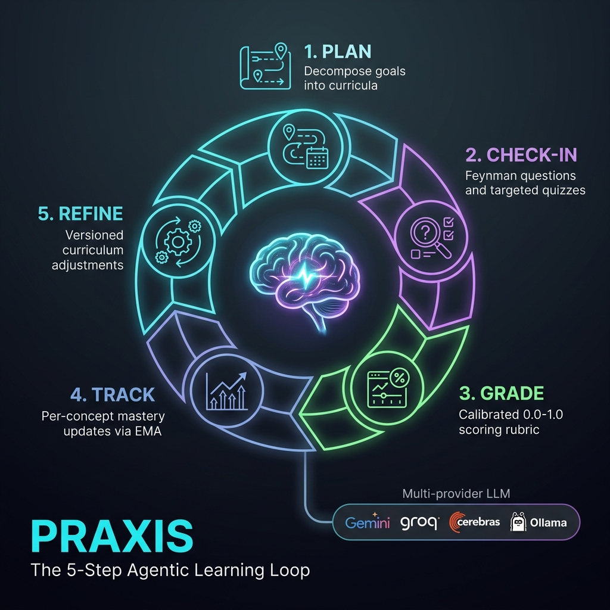
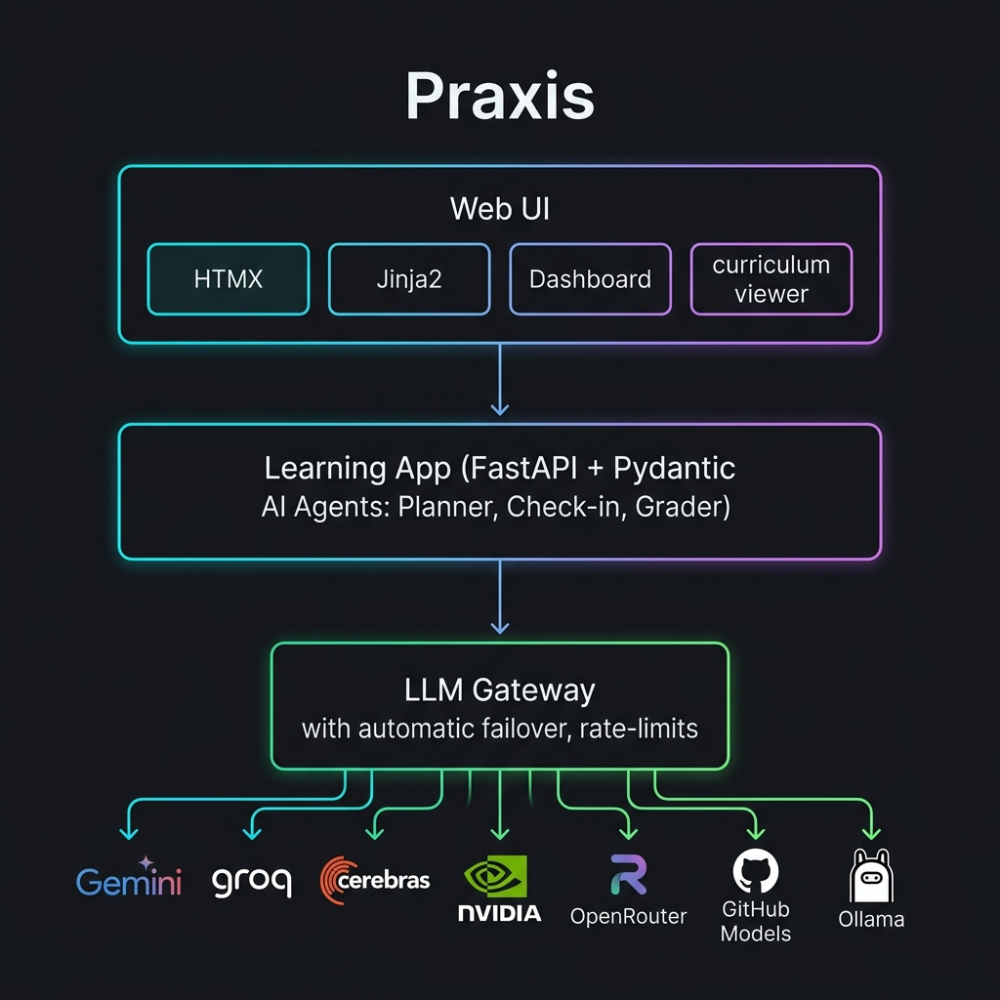

# Praxis

> **Agentic learning platform.** Tell it what you want to learn. Praxis gives you one clear next step each day, tracks what you actually know, and adapts the journey as you go.



Praxis runs on a **local multi-provider LLM gateway** (Gemini · Groq · Cerebras · NVIDIA · OpenRouter · GitHub Models · Ollama) with rate-limit-aware **failover**, so free-tier limits never break a learning session.

---

## Table of contents

1. [What this is](#1-what-this-is)
2. [Features](#2-features)
3. [Architecture](#3-architecture)
4. [Models & rate limits](#4-models--rate-limits)
5. [How failover works](#5-how-failover-works)
6. [Quickstart](#6-quickstart)
7. [Configuration](#7-configuration)
8. [HTTP API](#8-http-api)
9. [Project structure](#9-project-structure)
10. [Design principles](#10-design-principles)
11. [Learning modes](#11-learning-modes)
12. [Tech stack](#12-tech-stack)
13. [License](#13-license)

---

## 1. What this is

Praxis is an opinionated, single-user learning app. You give it a goal — *"understand the transformer architecture in 7 days, intermediate level"* — and it runs a structured loop:

1. **Plan** — an agent decomposes the goal into a sequenced, day-by-day curriculum with concrete activities.
2. **Check in** — each day, a short diagnostic: one Feynman-style explanation question + two targeted quiz questions on your weakest concepts.
3. **Grade** — a second agent scores each answer on a calibrated 0.0–1.0 rubric, with feedback and named gaps.
4. **Track** — per-concept mastery updates via a recency-biased exponential moving average.
5. **Adapt** — weak concepts change upcoming practice, and you can adjust the plan when your time or prior knowledge changes.

Each goal uses one consistent workspace:

- **Today** — the recommended lesson and the next Learn → Practice → Check sequence.
- **Journey** — the full schedule, milestones, success criteria, progress, and personal targets.
- **Practice** — review questions, adaptive quizzes, guided help, notes, and topic-level progress.

Every LLM call goes through a **local gateway** that rotates across providers transparently. Advanced model and agent details remain available without competing with the learner's primary task.

---

## 2. Features

- **Day-by-day curriculum generation**, streamed live as the agent reasons.
- **Professional content quality gates** — plans and questions are rejected when they are vague, incomplete, poorly sequenced, or lack measurable answer criteria.
- **A simplified Today / Journey / Practice workspace** with one recommended next action.
- **Interactive milestones and personal targets** backed by real plan, mastery, and completion data.
- **Daily check-ins** — 1 Feynman + 2 quiz questions targeted at your weakest concepts.
- **Feynman mode** — explain a concept in your own words; a tutor finds the gaps and asks Socratic follow-ups until your explanation is solid, then updates mastery.
- **Spaced-repetition flashcards** — cards generated from the active curriculum, with FSRS-inspired stability/difficulty scheduling.
- **Adaptive quiz mode** — weak concepts receive recall prompts; stronger concepts receive application and edge-case prompts.
- **Socratic explainer** — guided discovery through one focused question at a time.
- **Shared concept graph** — all modes read and update one prerequisite graph and mastery substrate.
- **Note ingestion** — upload text/Markdown/CSV/JSON and attach extracted concepts to a goal.
- **Automatic replanning** — repeated low mastery inserts targeted review into the next unfinished day and records the adjustment.
- **Learner profiles** — multiple local profiles with isolated goal lists.
- **Verified resources** — a built-in web-search tool finds *real* links for each day and a verifier agent confirms which exist, so suggestions aren't hallucinated.
- **Calibrated LLM grading** with feedback, confidence, and named knowledge gaps.
- **Per-concept mastery tracking** via a recency-biased EMA.
- **Plan refinement** with full versioning.
- **Multi-provider gateway** with automatic failover, rate limiting, and per-call telemetry.
- **OpenAI-compatible API** — point any OpenAI client at the gateway and use your whole provider pool.
- **Live dashboard** at `/status` showing per-provider usage and call history.
- **Server-rendered UI** — HTMX + Jinja, no SPA build step.

---

## 3. Architecture



```
┌──────────────────────────────────────────────────────────────────┐
│  Browser  (HTMX + Jinja, no SPA build step)                      │
│  /              goal entry · streams thinking · redirects on done │
│  /goals/{id}    Today: recommended lesson + next actions          │
│  /goals/{id}/roadmap  Journey: milestones, targets, progress      │
│  /goals/{id}/lab      Practice: review, quiz, guided help, notes  │
│  /goals/{id}/feynman  explain-a-concept loop (Feynman mode)       │
│  /days/{id}     check-in flow · verify real resources             │
│  /status        live gateway dashboard                            │
└────────────────────────────┬─────────────────────────────────────┘
                             │ HTTP (JSON or SSE)
                             ▼
┌──────────────────────────────────────────────────────────────────┐
│  Learning app  (FastAPI + Pydantic AI)                           │
│  • Planner agent      (pinned: Gemini)                            │
│  • Check-in agent     (pinned: Groq)                              │
│  • Grader agent       (pinned: Groq)                              │
│  • Feynman tutor      (pinned: Groq)                              │
│  • Resource verifier  (pinned: Groq) ← web-search tool           │
│  • learning.db ← plans, mastery, milestones, targets, practice state │
└────────────────────────────┬─────────────────────────────────────┘
                             │ HTTP (gateway's OpenAI-compat shim)
                             ▼
┌──────────────────────────────────────────────────────────────────┐
│  Gateway  (FastAPI, multi-provider router)                       │
│  • /v1/chat                     native shape                      │
│  • /v1/openai/chat/completions  OpenAI-compatible shim            │
│  • Per-provider rate-limit, cooldown & token tracking             │
│  • Exponential backoff on 429 / 5xx / timeout / auth errors       │
│  • gateway.db ← one row per LLM call                              │
└────────────────────────────┬─────────────────────────────────────┘
                             │ HTTPS
   ┌──────┬──────┬───────────┼─────────┬────────────┬────────┐
   ▼      ▼      ▼           ▼         ▼            ▼        ▼
 Gemini  Groq  Cerebras   NVIDIA   OpenRouter  GitHub    Ollama
                                               Models   (local)
```

**Two databases, two responsibilities:**

| | `gateway.db` | `learning.db` |
|---|---|---|
| **Owner** | Gateway | Learning app |
| **Holds** | One row per LLM call (provider, model, tokens, latency, status) | Goals, plans, plan_days, mastery, check_ins |
| **Answers** | *"Which provider served this, and how fast?"* | *"What does this learner know?"* |

The gateway has **no** awareness of users/goals/mastery; the learning app has **no** awareness of provider routing. Either can be swapped independently.

---

## 4. Models & rate limits

Defaults shipped in the code. Every model is overridable per provider in `.env`; the limits below are conservative free-tier ceilings the gateway enforces to avoid hitting provider quotas.

### Default model per provider

| Provider | Default model | Override env var |
|---|---|---|
| Gemini | `gemini-2.5-flash-lite` | `GEMINI_MODEL` |
| Groq | `llama-3.3-70b-versatile` | `GROQ_MODEL` |
| Cerebras | `zai-glm-4.7` | `CEREBRAS_MODEL` |
| NVIDIA | `mistralai/mistral-nemotron` | `NVIDIA_MODEL` |
| OpenRouter | `nvidia/nemotron-3-super-120b-a12b:free` | `OPENROUTER_MODEL` |
| GitHub Models | `openai/gpt-4.1-mini` | `GITHUB_MODEL` |
| Ollama (local) | *(your local model)* | `OLLAMA_MODEL` |

### Rate limits

`RPM` = requests/min · `RPD` = requests/day · `TPM` = tokens/min · `TPD` = tokens/day · `Cooldown` = min seconds between calls · `Context` = max prompt+output tokens per call.

| Provider | RPM | RPD | TPM | TPD | Cooldown | Context |
|---|---:|---:|---:|---:|---:|---:|
| Gemini | 15 | 1,000 | 250,000 | — | 4 s | 1,000,000 |
| Groq | 30 | 1,000 | 12,000 | 100,000 | 2 s | 100,000 |
| Cerebras | 5 | 2,400 | 30,000 | 1,000,000 | 12 s | 8,000 |
| NVIDIA | 40 | — | 100,000 | — | 2 s | 100,000 |
| OpenRouter | 20 | 50 | — | — | 3 s | 100,000 |
| GitHub Models | 10 | 50 | — | — | 6 s | 8,000 |
| Ollama (local) | ∞ | ∞ | ∞ | — | 0 s | 32,000 |

**Gemini** has the largest context window (1M tokens), which is why it's pinned as the planner. **Cerebras** is the tightest at 5 requests/minute, so it sits later in the failover order. For long curricula, Gemini's context is the deciding factor.

---

## 5. How failover works

The gateway picks the first **eligible** provider for each call:

1. **Candidates** — either the single provider you pinned, or the configured `LLM_ORDER`.
2. **Eligibility** — for each candidate, the router checks the context window, any active backoff, the cooldown, and the RPM / RPD / TPM / daily-token limits. The first that passes wins.
3. **On failure** — the provider is locked out with an exponential backoff sized to the error (a brief pause for a server hiccup, a long one for a daily-quota or auth failure), and the call falls through to the next provider.

Pinned providers and hard client errors (HTTP 400/401) raise immediately instead of failing over, so you get a clear error rather than a silent model switch. Every attempt is logged to `gateway.db` and visible on the `/status` dashboard.

---

## 6. Quickstart

```bash
# 1. Add at least one provider API key
cp .env.example .env
$EDITOR .env

# 2. Boot (uv handles venv + deps + uvicorn)
./run.sh

# 3. Open
open http://localhost:8099
```

You need **at minimum one** of: `GEMINI_API_KEY`, `GROQ_API_KEY`, `CEREBRAS_API_KEY`, `NVIDIA_API_KEY`, `OPEN_ROUTER_API_KEY`, `GITHUB_ACCESS_TOKEN`. The more you add, the more resilient failover becomes.

The default agent pins are `PLANNER_PROVIDER=gemini`, `CHECKIN_PROVIDER=groq`, `GRADER_PROVIDER=groq`, so **Gemini + Groq** is the recommended minimum. You can change pins in `.env` or pick a provider per goal from the UI dropdown.

---

## 7. Configuration

Set in `.env` (see `.env.example`):

| Variable | Default | Purpose |
|---|---|---|
| `GEMINI_API_KEY` … `GITHUB_ACCESS_TOKEN` | *(empty)* | Provider keys. An empty key disables that provider. |
| `*_MODEL` (per provider) | see [§4](#4-models--rate-limits) | Override the model for a provider. |
| `OLLAMA_URL` | `http://localhost:11434` | Local Ollama endpoint. |
| `OLLAMA_MODEL` | *(empty)* | Set to a pulled model to enable local Ollama. |
| `LLM_ORDER` | `gemini,groq,cerebras,nvidia,openrouter,github` | Failover order for `auto` routing. |
| `PLANNER_PROVIDER` | `gemini` | Provider the planner prefers. |
| `CHECKIN_PROVIDER` | `groq` | Provider the check-in agent prefers. |
| `GRADER_PROVIDER` | `groq` | Provider the grader prefers. |
| `FEYNMAN_PROVIDER` | `groq` | Provider the Feynman tutor prefers. |
| `VERIFIER_PROVIDER` | `groq` | Provider the resource verifier prefers. |
| `PRAXIS_PORT` | `8099` | Server port. |

---

## 8. HTTP API

### Gateway
| Method | Path | Purpose |
|---|---|---|
| `POST` | `/v1/chat` | Native chat with failover. |
| `POST` | `/v1/openai/chat/completions` | OpenAI-compatible shim (streaming + non-streaming). The `model` field is read as a provider name: `gemini`, `groq`, `auto`, or `provider/model-id`. |
| `GET` | `/v1/providers` | Configured providers, models, limits. |
| `GET` | `/v1/status` | Live per-provider usage + today's aggregates. |
| `GET` | `/v1/calls` | Recent call log (filter by `provider`, `status`). |

Point any OpenAI-compatible client (Cursor, Continue, LangChain, the OpenAI SDK) at `http://localhost:8099/v1/openai` to transparently use your whole provider pool.

### Learning app
| Method | Path | Purpose |
|---|---|---|
| `POST` | `/api/goals` · `/api/goals/stream` | Create a goal + generate a plan (JSON or SSE). |
| `POST` | `/api/goals/{id}/refine/stream` | Refine the active plan into a new version (SSE). |
| `GET` | `/api/goals` · `/api/goals/{id}/plan` | List goals / fetch a plan + days + mastery. |
| `POST` | `/api/days/{id}/checkin/start` | Generate today's question set. |
| `POST` | `/api/days/{id}/checkin/answer` | Submit + grade one answer; updates mastery. |
| `GET` | `/api/days/{id}/checkin/latest` | Latest completed check-in result. |
| `POST` | `/api/feynman/start` · `/api/feynman/reply` | Open a Feynman session for a concept; submit explanations turn-by-turn. |
| `GET` | `/api/goals/{id}/feynman/latest?concept=` | Latest completed Feynman session for a concept. |
| `POST` | `/api/days/{id}/resources/verify` | Web-search + verify this day's resources; attaches real URLs. |
| `GET` | `/api/days/{id}/resources` | Latest verified resources for a day. |
| `GET` | `/api/goals/{id}/flashcards` | List cards or the due review queue. |
| `POST` | `/api/goals/{id}/flashcards/generate` | Generate a quality-checked professional review deck. |
| `POST` | `/api/flashcards/{id}/review` | Schedule the next review and update mastery. |
| `POST` | `/api/adaptive/start` · `/api/adaptive/answer` | Run a mastery-targeted quiz. |
| `POST` | `/api/socratic/start` · `/api/socratic/reply` | Run a guided Socratic session. |
| `GET` | `/api/goals/{id}/concept-graph` | Shared concepts, prerequisites, and mastery. |
| `POST` | `/api/goals/{id}/notes` | Upload and ingest a UTF-8 note file. |
| `GET` · `POST` | `/api/users` | List or create local learner profiles. |
| `GET` | `/api/goals/{id}/roadmap` | Fetch milestones, mastery progress, and personal targets. |
| `POST` | `/api/goals/{id}/targets` | Add a persistent target to a learning journey. |
| `PATCH` · `DELETE` | `/api/targets/{id}` | Complete or remove a personal target. |

---

## 9. Project structure

```
praxis/
├── pyproject.toml              # uv project + deps
├── .env.example                # provider keys + agent pins
├── run.sh                      # uv sync + boot server
├── gateway.db / learning.db    # generated SQLite stores
└── src/praxis/
    ├── main.py                 # FastAPI entry, mounts all routers
    ├── config.py               # Settings (pydantic-settings, .env-loaded)
    │
    ├── gateway/                # ─── multi-provider LLM router
    │   ├── providers.py            # Adapter per vendor (uniform chat/stream)
    │   ├── router.py               # Rate-limit state + failover picker
    │   ├── core.py                 # Shared dispatch loop
    │   ├── routes.py               # /v1/chat, /v1/openai/..., /v1/status, /v1/calls
    │   ├── schemas.py              # Pydantic request/response models
    │   └── db.py                   # gateway.db schema + ops
    │
    ├── learning/               # ─── agentic learning loop
    │   ├── models.py               # Plan, PlanDay, Question, GradedAnswer, FeynmanTurn, ResourceCheck, ...
    │   ├── agents.py               # Agents, prompts, quality validation, flashcard generation
    │   ├── search.py               # keyless web-search tool (DuckDuckGo) for resource verification
    │   ├── db.py                   # learning.db schema + ops
    │   └── routes.py               # Goals, lessons, practice modes, roadmap, targets
    │
    └── web/                    # ─── server-rendered UI
        ├── routes.py               # Home, Today, Journey, Practice, lessons, status
        ├── templates/              # Jinja pages, including lab and roadmap
        └── static/style.css
```

---

## 10. Design principles

**Pydantic everywhere.** Every LLM call returns a Pydantic-validated structure — no regex-parsing of model output. Invalid JSON triggers an auto-retry with the validation error fed back to the model. This is the foundation that makes chained agents reliable.

**Quality checks beyond schema validation.** Pydantic validates structure, then deterministic instructional checks reject vague activities, missing milestones, weak rubrics, invalid concepts, fabricated resource URLs, and inconsistent grading.

**Progressive disclosure.** Learners see one recommended action first. The full schedule lives under Journey, optional learning modes live under Practice, and provider/reasoning details remain secondary.

**Many agents, right-sized providers.** Different jobs → different prompts, schemas, and pinned models: Planner → Gemini (long context, once per goal); Check-in, Grader, Feynman tutor, and resource verifier → Groq (fast, called interactively).

**Reasoning is separated from verification.** The planner is told never to invent URLs — but a prompt rule can't *check* anything. So real verification is a tool, not a vibe: a web-search step fetches actual links and a verifier agent confirms each suggested resource against them, attaching only real URLs and flagging the rest. The model reasons; the tool checks.

**Mastery as a recency-biased EMA.** `new = 0.6·old + 0.4·sample`. Improvement shows up fast and a single early mistake doesn't haunt you, while repeated results converge on the truth.

**Server-rendered UI.** No SPA, no build step, no `node_modules`. Vanilla JS only for streaming and the dashboard.

---

## 11. Learning modes

Praxis hosts **five learning modes** over one shared substrate (concept graph + mastery state).

| # | Mode | What it does | Status |
|---|---|---|---|
| 1 | **Curriculum agent** | Day-by-day plan + daily check-in + replanning | ✅ Shipped |
| 2 | **Feynman checks** | You explain a concept; the agent finds gaps and asks follow-ups until your explanation is solid | ✅ Shipped |
| 3 | **Spaced-repetition flashcards** | Generate curriculum cards, schedule reviews, update mastery | ✅ Shipped |
| 4 | **Adaptive quiz** | Targets weak spots; harder when you're solid, easier when you struggle | ✅ Shipped |
| 5 | **Socratic explainer** | Teaches by asking questions that lead you to the answer | ✅ Shipped |

**Also shipped:** a built-in **web-search tool** + **resource-verifier agent** so suggested resources are confirmed against real links (closes the planner's "don't invent URLs" gap). The search tool is keyless (DuckDuckGo HTML) and cleanly isolated, so it can later be swapped for an MCP search server.

**Also shipped in v0.2:** UTF-8 file/note ingestion through an MCP-ready HTTP boundary, automatic mastery-drift adjustments, a cross-mode concept graph, and multiple local learner profiles.

The profile system is intentionally local-first and does not provide passwords, authorization, or tenant security. Add an authentication layer before exposing Praxis to an untrusted network.

### Tests

```bash
UV_CACHE_DIR=/tmp/uv-cache uv run --with pytest pytest -q
```

---

## 12. Tech stack

| Layer | Choice |
|---|---|
| HTTP | **FastAPI** |
| Validation | **Pydantic v2** |
| Agents | **[Pydantic AI](https://ai.pydantic.dev/)** |
| Persistence | **SQLite** |
| Frontend | **HTMX + Jinja2** |
| Streaming | **Server-Sent Events** |
| Deps / env | **uv** · **pydantic-settings** |

---

## 13. License

MIT.

Built on [FastAPI](https://fastapi.tiangolo.com/), [Pydantic](https://docs.pydantic.dev/) / [Pydantic AI](https://ai.pydantic.dev/), [HTMX](https://htmx.org/), and [uv](https://github.com/astral-sh/uv). Inspired by the SM-2 / FSRS spaced-repetition algorithms, the Feynman technique, and Karpathy's "spelled-out" pedagogy.
